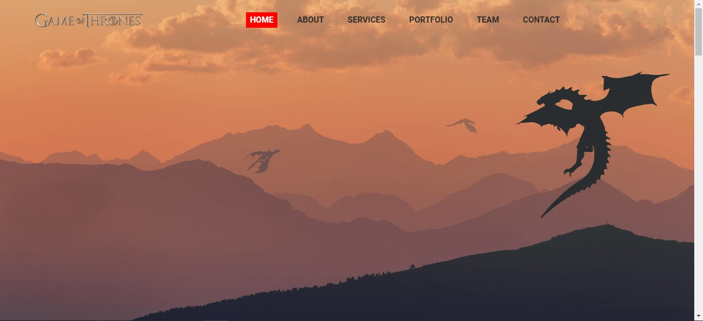

# Animated-Navbar
Menu animado com HTML, CSS, Bootstrap e Javascript.

<h1 align="center">
Animated Navbar
</h1>

Projeto estático desenvolvido utilizando somente HTML, CSS, Bootstrap e Javascript.

  

  
   
  

   
  

## Features

Essa página foi desenvolvida para praticar animação com Javascript e CSS.

## Getting started

Baixe ou clone o repositório: https://github.com/vitorbafoni/Animated-Navbar abra o arquivo index.html

## License

This project is licensed under the MIT License - see the [LICENSE](https://opensource.org/licenses/MIT) page for details.
